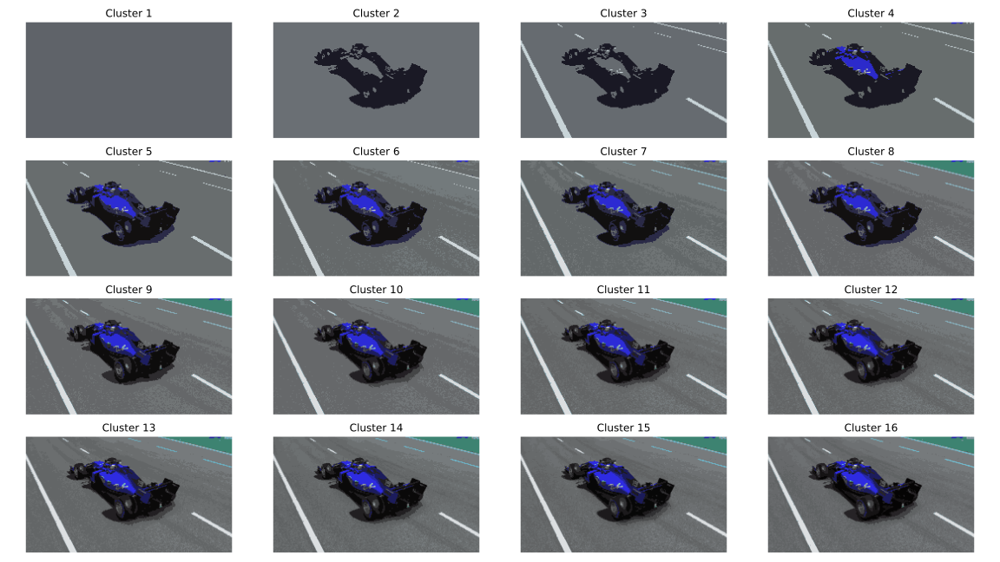
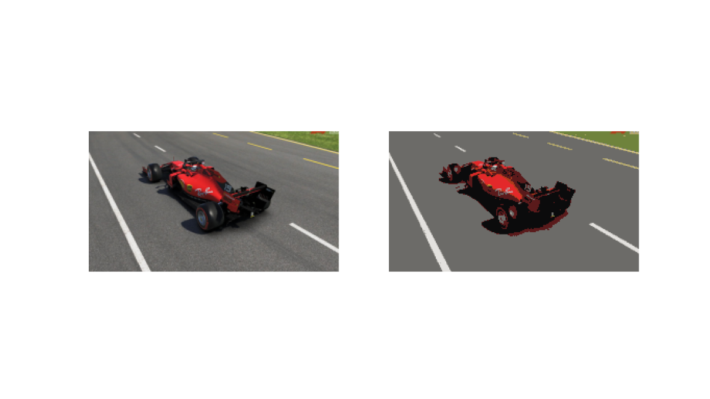

# segmentation-is-all-you-need
Is segmentation a fundamental step in computer vision? this repo aims to prove that there are problems in which segmentation shouldn't be performed to obtain better results.
Demo is available [here](demo.mov)

## **DATASET**
To carry out this task, the chosen [dataset](dataset) is composed of images from the 10 different scuderias in formula 1. 

## **STEPS**
To evaluate the segmentation, two different tasks were evaluated: classification and object detection.  
* `src/classification` : classification tasks scripts
* `src/segmentation` : segmentation tasks scripts
* `src/detection` : detection tasks scripts

## **SEGMENTATION**:

To start the segmentation process run the [src/segmentation/main.py](src/segmentation/main.py). 
Segmentation techniques include:

* _thresholding_:  
It's a type of segmentation in which we change the pixel of the image to make it easier to analyze. In
this case a threshold has been found using the Otsu's method which returns a single intensity threshold
that separate pixels into two classes, foreground and background. This threshold is determined by minimizing intra-class
intensity variance.

* _watershed_: The watershed transformation treats the image it operates upon like a topographic map, using the gradient
to finds the lines that run along the tops of ridges

* _clustering_: is an unsupervised learning algorithm that aims to group image's pixel into k given different
clusters

* _clustering adding coordinates as features_:

* _mean shift clustering_: is an unsupervised algorithm that aims to discover blobs in a smooth density of
samples. It's complexity however grows exponentially

## **PRESENTATION**
Presentation slides are available [here](Presentation.pdf)
