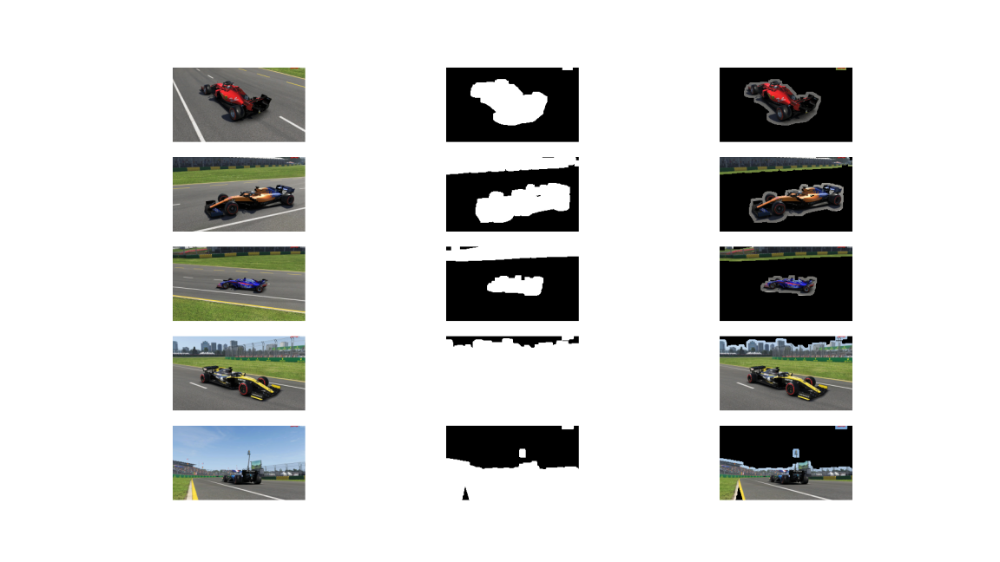
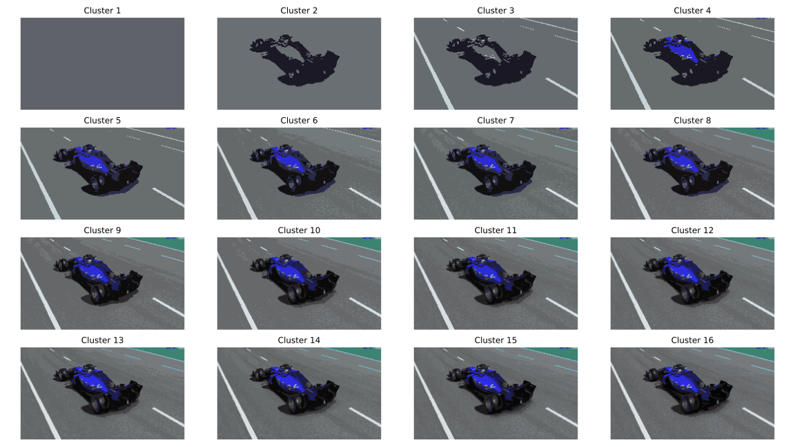
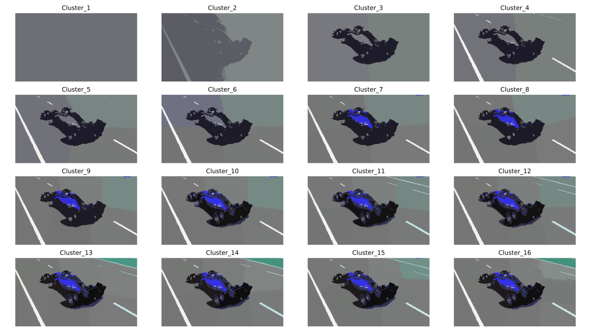
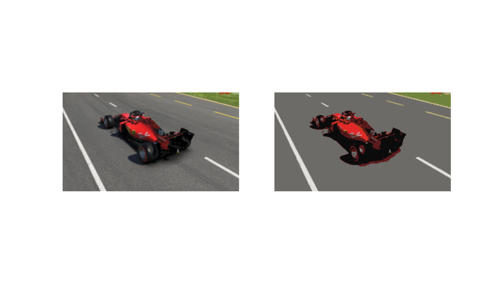

# Segmentation:

To start the segmentation process run the [main.py](main.py).

_thresholding_: 
It's a type of segmentation in which we change the pixel of the image to make it easier to analyze. In
this case a threshold has been found using the Otsu's method which returns a single intensity threshold
that separate pixels into two classes, foreground and background. This threshold is determined by minimizing intra-class
intensity variance.  

-----

_watershed_: The watershed transformation treats the image it operates upon like a topographic map, using the gradient
to finds the lines that run along the tops of ridges   

-----

_clustering_: is an unsupervised learning algorithm that aims to group image's pixel into k given different
clusters   

-----

_clustering adding coordinates as features_:  

-----

_mean shift clustering_: is an unsupervised algorithm that aims to discover blobs in a smooth density of
samples. It's complexity however grows exponentially   

-----
